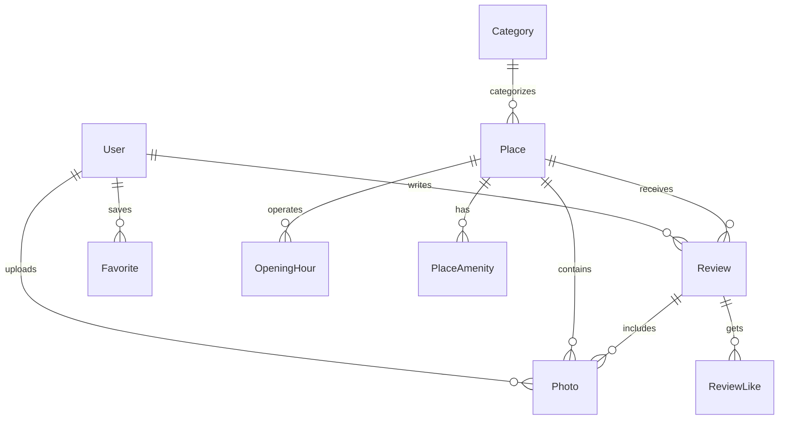

# 🍽️ Yelp India — Discover & Explore Culinary Destinations Across India

[](https://yelp-india.vercel.app)
[](https://nextjs.org/)
[](https://react.dev/)
[](https://www.typescriptlang.org/)
[](https://tailwindcss.com/)
[](https://www.prisma.io/)
[](https://supabase.com)

---

## 🔗 Live Application Access

> ### 🌐 **Click to Open Live App**: [https://yelp-india.vercel.app](https://yelp-india.vercel.app)
> **GitHub Repository**: [https://github.com/2200030440/yelp_india](https://github.com/2200030440/yelp_india)

---

## 🎯 Goal & Vision of Yelp India

**Yelp India** is a production-grade, enterprise-ready web application built to digitize, index, and celebrate the rich culinary diversity of India. From iconic street food hubs in Old Delhi and legendary Hyderabadi Biryani houses to luxury fine-dining establishments in Mumbai and vibrant coastal cafes in Goa, **Yelp India** provides a unified platform for discovering, evaluating, and sharing dining experiences.

### The Problem We Solve
Traditional global discovery platforms often lack localized Indian context—such as regional food categories (e.g., pure vegetarian filters, regional thali specialties, street food stalls, cafe-bakeries), accurate Indian city geocoding, and smooth interactive map performance across 50+ Indian metropolitan and tier-2/3 cities.

### Key Objectives
1. **Nationwide Food & Restaurant Indexing**: Multi-city coverage spanning major metros (Mumbai, Delhi NCR, Bengaluru, Hyderabad, Chennai, Kolkata, Pune) as well as emerging hubs (Vijayawada, Vizag, Jaipur, Kochi, Lucknow, etc.).
2. **Interactive Map-First Discovery**: Real-time Leaflet map integration rendering thousands of verified location markers alongside live GPS geolocation and distance sorting.
3. **Authentic Community Reviews**: Trustworthy review and rating system featuring user-uploaded photos via Cloudinary, star ratings, and community helpfulness likes.
4. **Seamless Business & Admin Management**: Role-based administration dashboard empowering moderators to manage places, review flags, and maintain data quality.

---

## ✨ Key Features & Capabilities

### 📍 1. Interactive Nationwide Map Experience
* **Real-time Map Rendering**: Powered by OpenStreetMap and Leaflet.js with custom category marker pins.
* **Live GPS Location Pulse**: Automatically detects user location and displays a glowing blue animated GPS pin on the map.
* **City Camera Auto-Pan**: Selecting a city (e.g., *Hyderabad*, *Vijayawada*, *Mumbai*, *Bengaluru*) automatically pans and zooms the map bounds to that city's coordinates.
* **Clustered Map Markers**: High-performance Leaflet MarkerCluster handling thousands of pins smoothly without lagging.

### 🔍 2. Advanced Multi-Parametric Search & Filtering
* **Instant City & Keyword Search**: Auto-complete location suggestions for 50+ Indian cities and states.
* **Cuisine Taxonomies**: Filter by specific categories:
  * 🍛 *North Indian* (Dhabas, Thalis, Tandoori)
  * 🫓 *South Indian* (Dosas, Idlis, Tiffins)
  * 🍗 *Biryani & Kebabs* (Hyderabadi, Lucknowi, Kolkata Biryani)
  * 🍷 *Fine Dining* & Multi-Cuisine
  * ☕ *Cafes & Bakeries*
  * 🥪 *Street Food & Local Eats*
  * 🍨 *Desserts & Ice Cream*
* **Price Range Filter**: Budget (under ₹300), Moderate (₹300–₹700), Fine Dining (₹700–₹1500), and Luxury (₹1500+).
* **Pure Veg Toggle**: One-click filtering for strictly vegetarian establishments (`isVegOnly`).
* **Dynamic Sorting**: Sort results by *Highest Rated*, *Most Reviewed*, *Nearest to Me*, or *Newest Added*.

### 🏪 3. Rich Restaurant & Place Profiles
* **Interactive Photo Galleries**: High-resolution carousel views for restaurant ambiance, food items, and menus.
* **Operating Hours**: Full 7-day business hours grid highlighting real-time "Open Now" or "Closed" status.
* **Contact & Directions**: Phone numbers, email, official website links, and one-click Google Maps navigation.
* **Amenities List**: Parking, AC, Outdoor Seating, Wi-Fi, Home Delivery, and Reservation options.

### 🌟 4. Community Reviews & Photo Submissions
* **Star Rating System**: 1 to 5-star ratings calculated automatically into aggregated average place scores.
* **Rich Media Uploads**: Upload food and venue photos directly via Cloudinary client/server integration.
* **Helpful Review Likes**: Upvote insightful reviews to highlight community recommendations.

### 🔐 5. NextAuth v5 Authentication & User Profile
* **OAuth 2.0 Integration**: Sign in with Google or GitHub with a single click.
* **Credentials Auth**: Standard email & password registration backed by `bcryptjs` hashing.
* **User Bookmarks & Saved Places**: Save favorite restaurants into a personal collection (`/saved`).
* **Personal Activity Dashboard**: Track published reviews, submitted photos, and account settings (`/profile`).

### 🛡️ 6. Admin & Moderation Portal
* **Role-Based Access Control (RBAC)**: Support for `USER`, `MODERATOR`, and `ADMIN` user roles.
* **Place Management**: Add, update, feature, or soft-delete restaurant listings.
* **Review Moderation**: Approve or dismiss flagged community reviews and review reports.
* **Audit Logging**: Trace administrative actions with system audit log records.

---

## 🛠️ Tech Stack & Technologies Used

Yelp India is built using a modern, scalable, and type-safe architecture:

| Domain / Layer | Technology | Usage & Purpose |
| :--- | :--- | :--- |
| **Framework** | **Next.js 16 (App Router)** | Full-stack SSR/SSG framework, Route Handlers, Server Actions & Middleware |
| **Language** | **TypeScript 5 (Strict)** | End-to-end static type safety across database schemas, API routes, and components |
| **UI Library** | **React 19** | Modern UI layout rendering with Concurrent Mode & Server Components |
| **Styling & CSS** | **Tailwind CSS v4** | Utility-first styling engine with custom color tokens and modern flex/grid layouts |
| **Icons & Design** | **Lucide Icons** | Clean vector iconography for cuisine categories, stars, and navigation |
| **Animations** | **Framer Motion** | Smooth UI transitions, modal animations, micro-interactions, and glowing pins |
| **Database** | **PostgreSQL (Supabase)** | Cloud-hosted PostgreSQL database with connection pooling enabled |
| **Database ORM** | **Prisma ORM v6** | Type-safe query builder, migration engine, soft deletes, and database seeding |
| **Authentication** | **Auth.js (NextAuth v5)** | Next.js Edge-compatible authentication with Google, GitHub, and Credentials OAuth |
| **State & Data Fetching** | **TanStack Query v5** | Server-state management, client caching, revalidation, and pagination state |
| **Interactive Maps** | **Leaflet 1.9 & React-Leaflet 5** | Mobile-friendly interactive maps, OpenStreetMap tiles, and custom SVG markers |
| **Form Management** | **React Hook Form + Zod** | Controlled forms with schema validation for login, signup, place creation, and reviews |
| **Media Hosting** | **Cloudinary** | Cloud photo storage, dynamic image cropping, optimization, and blur placeholders |
| **Transactional Email** | **Resend API** | Automated email dispatch for user welcome and password workflows |
| **Deployment** | **Vercel** | Edge Network deployment hosted in Mumbai (`bom1`) serverless region |

---

## 📁 Project Directory Structure

```text
yelp-india/
├── 📁 actions/                    # Server Actions (auth, places, reviews, favorites)
│   ├── auth-actions.ts            # Authentication helper actions
│   ├── favorite-actions.ts        # Toggle favorite bookmarks
│   ├── place-actions.ts           # Create/update place listings
│   └── review-actions.ts          # Submit & moderate reviews
├── 📁 app/                        # Next.js App Router (Pages, Layouts & API)
│   ├── 📁 (admin)/                # Admin portal dashboard routes (/admin)
│   ├── 📁 (auth)/                 # Authentication pages (/login, /register)
│   ├── 📁 (main)/                 # Core user-facing routes
│   │   ├── 📁 map/                # Full-screen interactive map page (/map)
│   │   ├── 📁 places/             # Place listing & detail pages (/places, /places/[slug])
│   │   ├── 📁 profile/            # User profile dashboard (/profile)
│   │   ├── 📁 saved/              # Bookmarked saved places (/saved)
│   │   ├── 📁 search/             # Keyword & category search (/search)
│   │   └── page.tsx               # Homepage with hero section & featured places
│   ├── 📁 api/                    # API Route Handlers (/api/places, /api/reviews, /api/auth)
│   ├── globals.css                # Global CSS styles & Tailwind v4 directives
│   ├── layout.tsx                 # Root layout & providers
│   └── sitemap.ts                 # Dynamic SEO sitemap generator
├── 📁 components/                 # React UI Components
│   ├── 📁 common/                 # Core features (PlacesMap, CitySelector, RestaurantCard, PhotoGallery)
│   ├── 📁 layout/                 # Main Header/Navbar, Footer, Mobile Navigation
│   └── 📁 ui/                     # Reusable UI primitives (Button, Input, Card, Modal, Badge)
├── 📁 config/                     # Application & Site Configuration (siteConfig, nav links)
├── 📁 constants/                  # Application constants (Indian cities, categories, price levels)
├── 📁 context/                    # Custom React Contexts (LocationContext, UserContext)
├── 📁 lib/                        # Core utility libraries (Prisma client, Auth config, Cloudinary, Resend)
├── 📁 prisma/                     # Database layer
│   ├── schema.prisma              # Comprehensive PostgreSQL database schema
│   └── 📁 seed/                   # Database seed scripts with realistic Indian places data
├── 📁 providers/                  # React Query, Auth Session, and Theme providers
├── 📁 public/                     # Static assets, logos, map marker icons, default placeholders
├── 📁 scripts/                    # Dedicated data seeding scripts (Google Places, OSM, City seeds)
├── 📁 types/                      # Global TypeScript interfaces & type definitions
├── .env.example                   # Environment configuration template
├── next.config.ts                 # Next.js build & image domain configuration
├── package.json                   # Dependencies & npm scripts
├── vercel.json                    # Vercel deployment configuration & CORS security headers
└── README.md                      # Project documentation
```

---

## ⚡ Getting Started & Local Development Process

Follow this step-by-step guide to set up **Yelp India** locally on your machine.

### Prerequisites

Ensure you have the following installed on your development machine:
* **Node.js**: v18.17.0 or higher
* **npm**: v9.0.0 or higher
* **PostgreSQL**: Local PostgreSQL instance OR a free [Supabase](https://supabase.com) database project

---

### Step 1: Clone the Repository

```bash
git clone https://github.com/2200030440/yelp_india.git
cd yelp_india
```

---

### Step 2: Install Project Dependencies

```bash
npm install
```

---

### Step 3: Configure Environment Variables

Create a `.env.local` file in the root directory by copying the sample file:

```bash
cp .env.example .env.local
```

Fill in the required environment parameters in `.env.local`:

```env
# Database Connection (Supabase PostgreSQL)
DATABASE_URL="postgresql://postgres:[PASSWORD]@[HOST]:6543/postgres?pgbouncer=true"
DIRECT_URL="postgresql://postgres:[PASSWORD]@[HOST]:5432/postgres"

# NextAuth v5 Authentication
AUTH_SECRET="your-super-secret-32-character-auth-key"
NEXTAUTH_URL="http://localhost:3000"
NEXT_PUBLIC_APP_URL="http://localhost:3000"

# Google OAuth Credentials (Google Cloud Console)
AUTH_GOOGLE_ID="your-google-client-id"
AUTH_GOOGLE_SECRET="your-google-client-secret"

# GitHub OAuth Credentials (GitHub Developer Settings)
AUTH_GITHUB_ID="your-github-client-id"
AUTH_GITHUB_SECRET="your-github-client-secret"

# Cloudinary Storage Configuration
NEXT_PUBLIC_CLOUDINARY_CLOUD_NAME="your-cloud-name"
CLOUDINARY_API_KEY="your-cloudinary-api-key"
CLOUDINARY_API_SECRET="your-cloudinary-api-secret"

# Google Places & Maps API Keys (Optional for live seeding)
GOOGLE_PLACES_API_KEY="your-google-places-key"
NEXT_PUBLIC_GOOGLE_MAPS_API_KEY="your-google-maps-key"

# Resend Email Service (Optional for development)
RESEND_API_KEY="re_123456789"
```

---

### Step 4: Synchronize Database & Generate Prisma Client

```bash
# Generate Prisma Client
npm run db:generate

# Push schema changes to your database
npm run db:push
```

---

### Step 5: Seed the Database with Sample Data

Run the database seed command to populate initial categories, cities, amenities, and restaurants:

```bash
# Primary database seed
npm run db:seed

# Optional: Seed specific city dataset (e.g. Hyderabad / Vijayawada)
npm run seed:hyderabad
```

---

### Step 6: Start the Development Server

```bash
npm run dev
```

Open your browser and navigate to **[http://localhost:3000](http://localhost:3000)** to explore Yelp India locally!

---

## 📜 Available NPM Scripts

| Script | Command | Purpose / Description |
| :--- | :--- | :--- |
| **`dev`** | `next dev` | Launches Next.js local development server at `http://localhost:3000` |
| **`build`** | `next build` | Compiles optimized production build bundle |
| **`start`** | `next start` | Runs the compiled Next.js production server |
| **`lint`** | `eslint` | Executes ESLint to check for syntax and style issues |
| **`lint:fix`** | `eslint --fix` | Automatically fixes repairable ESLint warnings and errors |
| **`format`** | `prettier --write .` | Formats all codebase files using Prettier |
| **`type-check`**| `tsc --noEmit` | Performs full TypeScript compilation type check |
| **`db:generate`**| `prisma generate` | Generates typed Prisma Client from `schema.prisma` |
| **`db:push`** | `prisma db push` | Pushes Prisma schema state directly to dev database |
| **`db:migrate`**| `prisma migrate dev` | Creates and applies database migrations in development |
| **`db:studio`** | `prisma studio` | Opens Prisma GUI Database Manager in browser |
| **`db:seed`** | `npx tsx prisma/seed/index.ts` | Seeds database with initial categories & restaurants |
| **`seed:hyderabad`**| `npx tsx scripts/seed-city-hyderabad.ts` | Seeds specialized Hyderabad dataset |
| **`seed:cities`** | `npx tsx scripts/seed-google-places.ts` | Fetches & seeds places from Google Places API |
| **`seed:osm`** | `npx tsx scripts/seed-osm-places.ts` | Fetches & seeds places from OpenStreetMap Overpass API |

---

## 📊 Database Schema Highlights

The database is built on PostgreSQL via Prisma ORM with soft deletes (`deletedAt`) and UUID primary keys across all tables:



---

## 🚀 Deployment & Production Setup

This project is optimized for effortless 1-click deployment on **Vercel**:

1. Push your repository to GitHub (`https://github.com/2200030440/yelp_india`).
2. Import the project into your **Vercel Dashboard**.
3. Set the Environment Variables (`DATABASE_URL`, `AUTH_SECRET`, `NEXTAUTH_URL`, `NEXT_PUBLIC_CLOUDINARY_CLOUD_NAME`, etc.).
4. Deployment build command is automatically handled via `vercel.json`:
   ```json
   {
     "framework": "nextjs",
     "buildCommand": "prisma generate && next build",
     "regions": ["bom1"]
   }
   ```
5. Your live app will be accessible globally at **[https://yelp-india.vercel.app](https://yelp-india.vercel.app)**.

---

## 📄 License & Attribution

Designed & Developed with ❤️ for food lovers across India.  
© 2026 **Yelp India**. All Rights Reserved.
